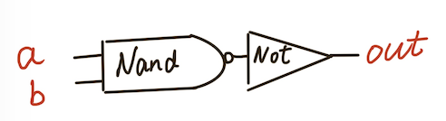
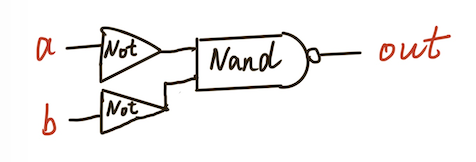
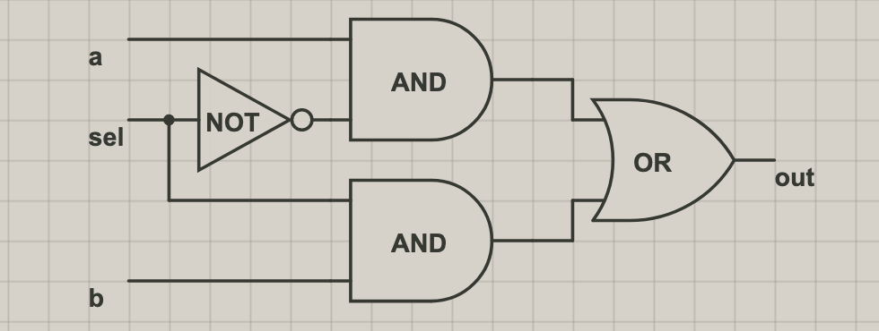
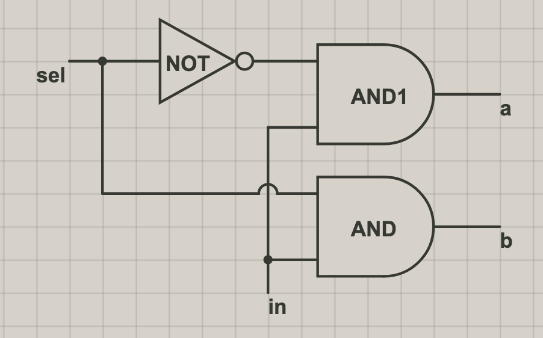
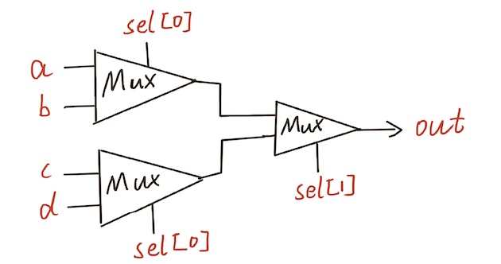
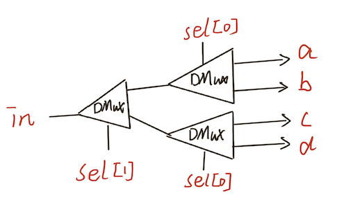

# Nand2Tetris
Nand2Tetris Graphs

## Gate Logic

#### Not

```
Chip name: Not
Inputs: in
Outputs: out
Function: If in=0 then out=1 else out=0.
```


#### And

```
Chip name: And
Inputs: a, b
Outputs: out
Function: If a=b=1 then out=1 else out=0.
```



#### Or

```
Chip name: Or
Inputs: a, b
Outputs: out
Function: If a=b=0 then out=0 else out=1.
```



#### Xor

```
Chip name: Xor
Inputs: a, b
Outputs: out
Function: If a=/b then out=1 else out=0.
```


#### Mux

```
Chip name: Mux
Inputs: a, b, sel
Outputs: out
Function: If sel=0 then out=a else out=b.
```



#### DMux

```
Chip name: DMux
Inputs: in, sel
Outputs: a, b
Function: If sel=0 then {a=in, b=0} else {a=0, b=in}.
```




#### Mux4Way

```
Chip name: Mux4Way16
Inputs: a[16], b[16], c[16], d[16], sel[2]
Outputs: out[16]
Function: If sel=00 then out=a else if sel=01 then out=b

else if sel=10 then out=c else if sel=11 then out=d Comment: The assignment operations mentioned above are all

16-bit. For example, "out=a" means "for i=0..15 out[i]=a[i]".
```



#### DMux4Way

```
Chip name: DMux4Way
Inputs: in, sel[2]
Outputs: a, b, c, d
Function: If sel=00 then {a=in, b=c=d=0}
else if sel=01 then {b=in, a=c=d=0} else if sel=10 then {c=in, a=b=d=0} else if sel=11 then {d=in, a=b=c=0}.
```



#### HalfAdder

```
Chip name: HalfAdder
Inputs: a, b
Outputs: sum, carry Function:sum =LSBofa+b
           carry = MSB of a + b
```

#### FullAdder

```
Chip name: FullAdder
Inputs:
Outputs:
Function:
a, b, c
sum, carry sum=LSBofa+b+c carry = MSB of a + b + c
```

#### Add16

```
Chip name: Add16
Inputs: a[16], b[16]
Outputs: out[16]
Function: out = a + b
Comment: Integer 2's complement addition.
Overflow is neither detected nor handled.
```

