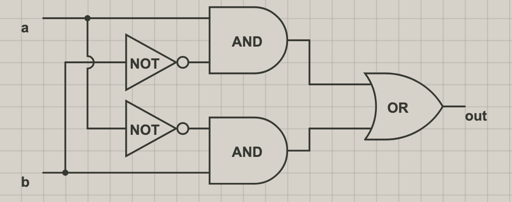

# Nand2Tetris
Nand2Tetris Graphs

## Gate Logic

#### Not

> Chip name: Not
>  Inputs: in
>  Outputs: out
>  Function: If in=0 then out=1 else out=0.

#### And

> Chip name: And
>  Inputs: a, b
>  Outputs: out
>  Function: If a=b=1 then out=1 else out=0.

#### Or

> Chip name: Or
>  Inputs: a, b
>  Outputs: out
>  Function: If a=b=0 then out=0 else out=1.

#### Xor

> Chip name: Xor
>  Inputs: a, b
>  Outputs: out
>  Function: If a=/b then out=1 else out=0.

#### Mux

> Chip name: Mux
>  Inputs: a, b, sel
>  Outputs: out
>  Function: If sel=0 then out=a else out=b.

#### DMux

> Chip name: DMux
>  Inputs: in, sel
>  Outputs: a, b
>  Function: If sel=0 then {a=in, b=0} else {a=0, b=in}.

